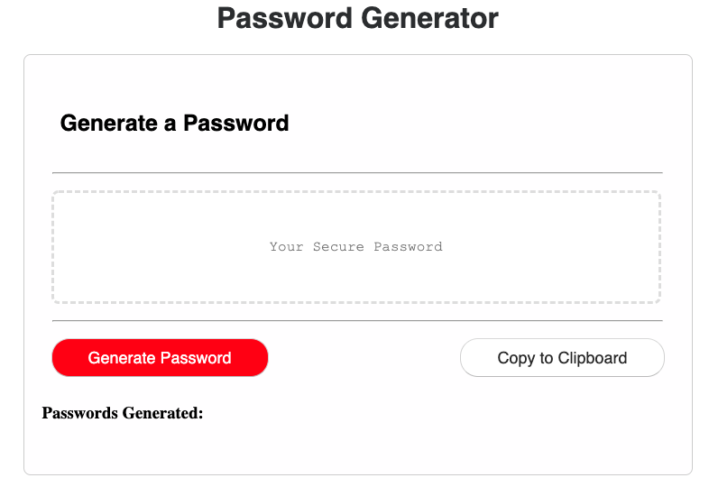

# JavaScript
Overview:
The purpose of this assignment is to generate an app that will allow users to create a password. The application should accomplish 3 tasks:
1. The ability for user to create a password that includes the following characters:
- Numbers
- Lower and Uppercase characters
2. Application should validate that user has input characters
3. Applicaton should generate and display password on screen

In the end the application should look like this: 
 

Visit: